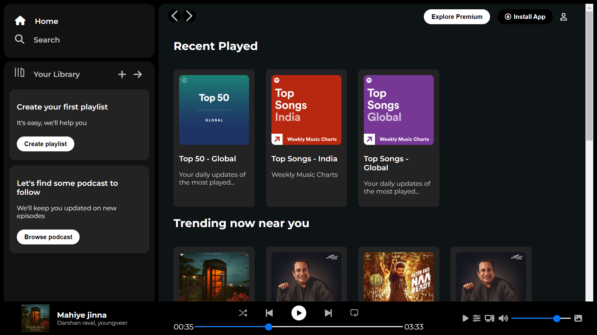

# Spotify Clone 🎧

Welcome to the Spotify Clone project! Dive into the world of music with this mini project built using the power of CSS Flexbox.

## Features ✨

- **Responsive Design**: Enjoy a seamless music experience on any device.
- **CSS Flexbox**: Leveraging Flexbox for efficient and flexible layout design.
- **Spotify-Inspired UI**: Mimicking the sleek and aesthetic design of Spotify.

## Technologies Used 💻

- **HTML**: Structuring the web page.
- **CSS Flexbox**: Creating responsive and dynamic layouts.

## Preview 📷



## Getting Started 🚀

1. **Clone the repository:**

   ```bash
   git clone https://github.com/GovardhaneNitin/Spotify-Clone.git
   ```

2. **Navigate to the project directory:**

   ```bash
   cd spotify-clone
   ```

3. **Open `index.html` in your browser.**

## Customization 🎨

Feel free to customize the content and styles to add your personal touch to the Spotify Clone.

## Contributing 🤝

Contributions are welcome! If you find any bugs or have ideas for improvements, please open an issue or create a pull request.

Rock on with your Spotify Clone! 🤘🎶
